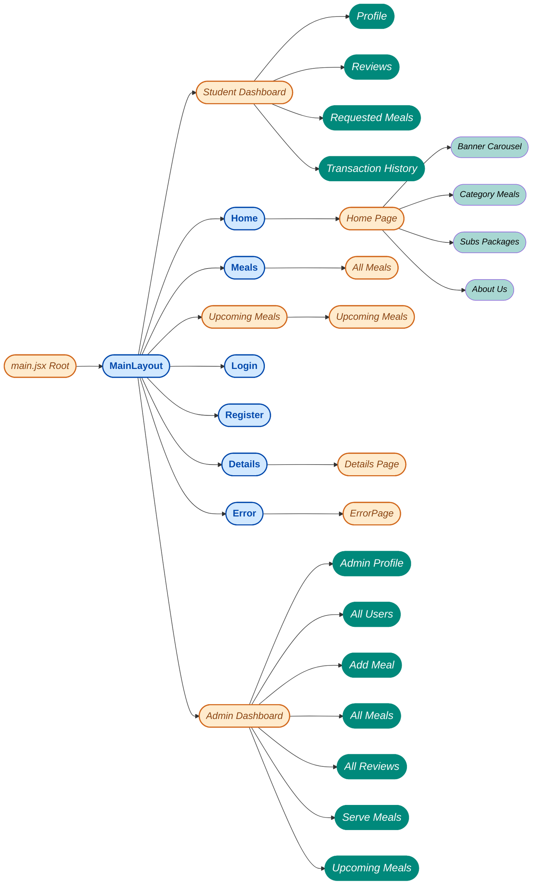
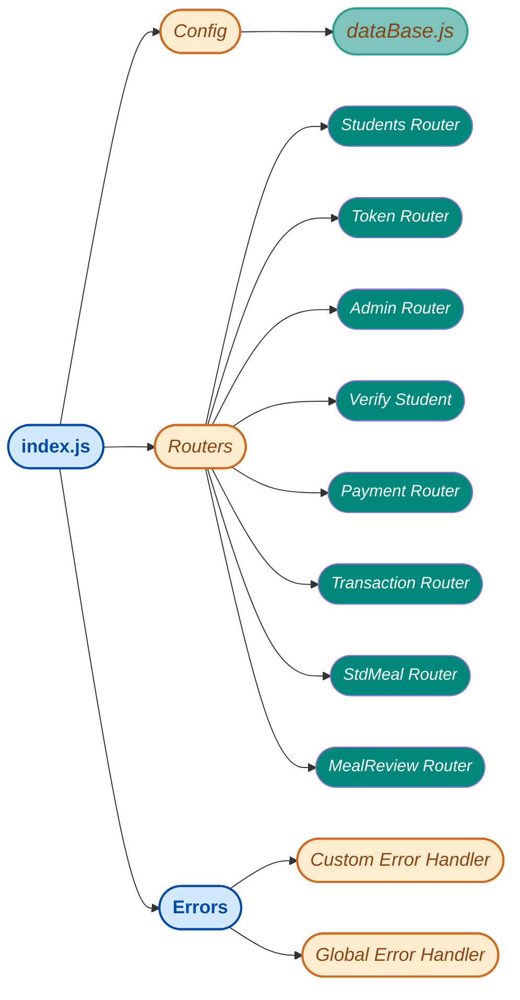
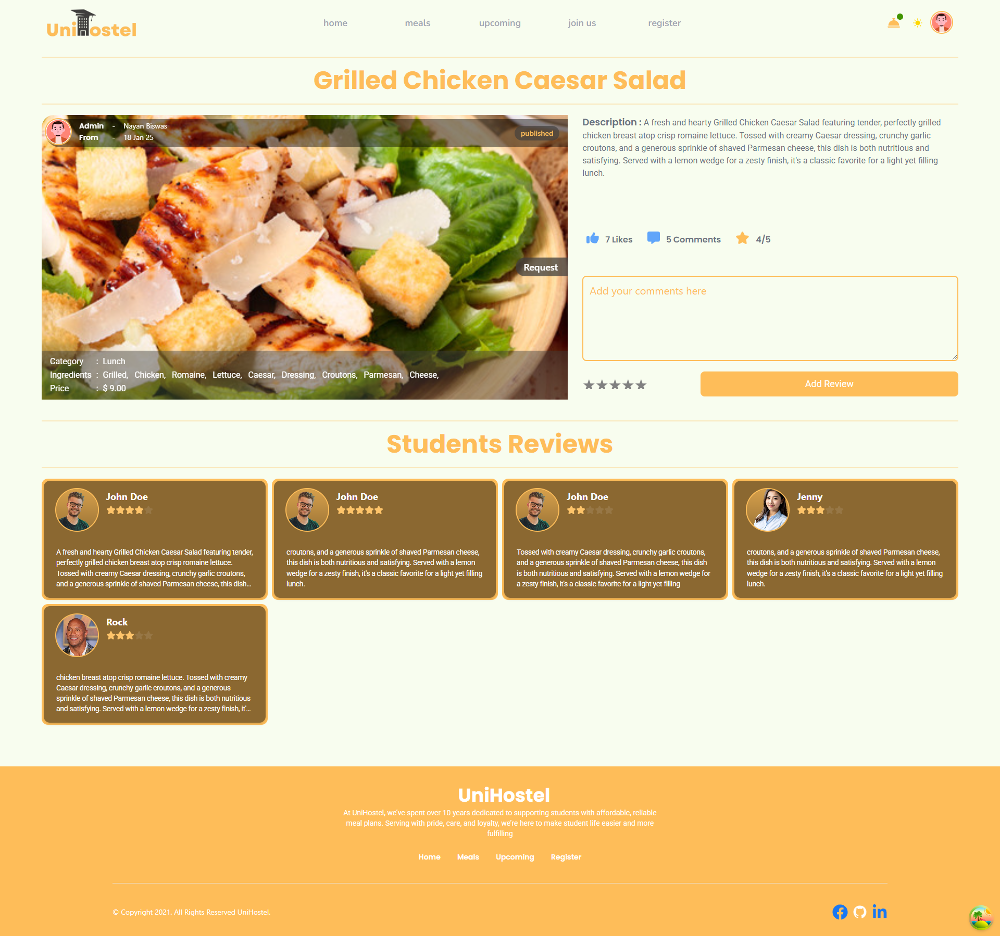
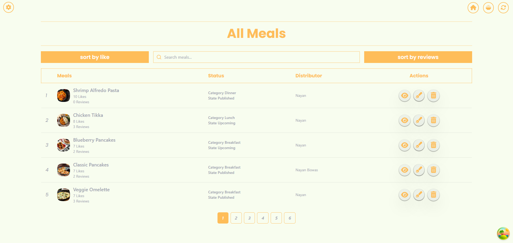
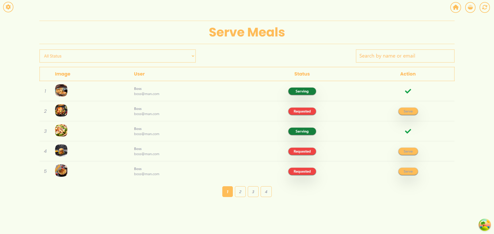

<a>

serving enlightened minds with dignity

</a>

***
#### *Short Overview*
*unihostel is for university students who want to get hustle free food for daily and monthly basis, Terms are simple buy any subscription packages for months and get all the benefits under the condition of subscription, Only logged in students and subscribed students can access whole website*

#### *Student Notes*
- *To stay hustle free Google Signin available, If anyone want to login anonymously can signUp with few credentials*
- *for email and password **(Note:password should be 6characters long and must have a special character, one uppercase and lowercase letters)***

- *Student can request same meal once a time till admin approval, Before approval he can cancel his request of that specific meal, after served or cancel that request he can request for the same meal again*
- *Students can leave reviews admin don't have that access, or they can edit delete or update his review if anything found wrong*
- *Payment dashboard section contains all the information of students transactions*
- *On upcoming meal section, student can leave comment and like that particular meal, if the like limit reached 10!! it will be published automatically*

#### *Admin Notes*

- *On admins dashboard, admin can edit delete or Update existed meals*
- *Admin can track down users status and can filter out based on name email and subscriptions, Admin can give access to an individual of an admin*
- *Admin can publish the upcoming announced meals or can add meals and can add new one*
- *Admin can filter out the less interacted of favorite meals and can take actions*
- *Admin can remove miss leading reviews as well*

#### *Technologies*
***This simple single page website was created with-***
- ***Framer Motion***
  - Basic Enter Animation.
  - Gestures.
  - WhileInView
  
- ***React with Vite***
    - useState 
    - useEffect,
    - Context API..
    - Custom Hooks..
    - Reusable Components.
  
- ***React Router Dom***
  - useRouterError,
  - Navigate Component,
  - Outlet,  
  - useNavigate,
  - useLocation,
  - Link

- ***Firebase Authentications***
  - Google SigIn
  - Sign Up with Email and Password
  - Update Profile
  - Signin with Email & Password

- ***Node js & Express js***
  - POST
  - GET
  - PUT
  - PATCH
  - DELETE methods
  - Router
  - Middlewares
  - Error handlers
- ***MongoDB.***
  - insertOne()
  - find()
  - findOne()
  - DeleteOne()
  - updateOne()
- ***Others***
  - tanStackQuery
  - axios
  - react-hook-form
  - react-rating-stars-component
  - react-scroll-parallax
  - sweetAlert2
  - daisy-ui
  - lenis

 

<a>
<h1 align="center">Routes & Components</h1>
</a>

 

<a>
<h1 align="center">Server Routers and Handlers</h1>
</a>

 
 
 
 

    <a>
    <h4><i></i></h4>
    </a>
    

 
 
 
 
 

### *Thanks for Visiting*
### <a>*UniHostel*</a>

***The more deeply you understand the problem, the more likely you are to land on an elegant and effective solution.***

<a> ― *Luke Wroblewski*</a> 

 
 
 
 
 
 

[**_Feel Free to Visit UniHostel_**](https://unihostel.netlify.app)
 

    <a>
    <h1 align="center">UniHostel</h1>
    
short overview of this simple project

    </a>
    

 

clientClassroom - https://github.com/Programming-Hero-Web-Course4/b10a12-client-side-Dev-NayanBiswas.git

serverClassroom - https://github.com/Programming-Hero-Web-Course4/b10a12-server-side-Dev-NayanBiswas.git

